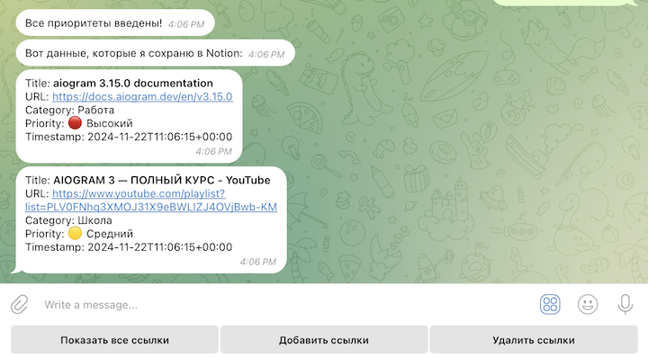
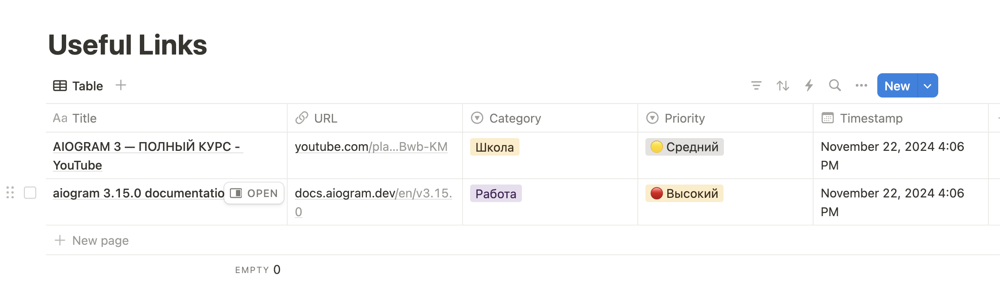

# Notion-saver-bot


## Функциональность 

Бот обладает следующими функциями: 

    - Показать все ссылки, сохраненные в Notion: /Start -> "Показать все ссылки"

    - Добавить (конкретные) ссылки, отправленные пользователем, в Notion: /Start -> "Добавить ссылки"
            - После того, как пользователь отправит ссылки боту, он сможет выбрать конкретные ссылки для сохранения в Notion
            - Затем, следуя инструкциям, выбрать "категорию" для каждой ссылки 
            - Затем, следуя инструкциям, выбрать "приоритет" для каждой ссылки 
            - Бот попытается автоматически извлечь 'title' для предоставленных URL
            - После того, как пользователь введет все данные, бот сохранит их в базе данных Notion, 
              локальной базе данных и выведет данные для пользователя. Например,       




    - Удалить (конкретные) ссылки, которые пользователь сохранил в Notion: /Start -> "Удалить ссылки"

Пример базы данных Notion с сохранёнными ссылками: 




## Usage 

- Создать и инициализировать виртуальное окружение 
    - ```python3 -m venv <virtual-environment-name>```

    - ```source <virtual-environment-name>/bin/activate``` (on MacOS)  or  
      ```<virtual-environment-name>\Scripts\activate``` (Windows)

- Установить зависимости
    - ```python3 -m pip install -r requirements.txt```

- Запустить Бота
    - Определите следующие переменные окружения в файле ```.env```: 
        - ```DB_URL```: путь к локальной базе данных
        - ```NOTION_TOKEN```: Notion API access token 
        - ```DATABASE_ID```: id базы данных в Notion
    
    - ```cd path/to/notion-saver-bot/directory```

    - Запустить Бота: ```python3 -m tgbot```


